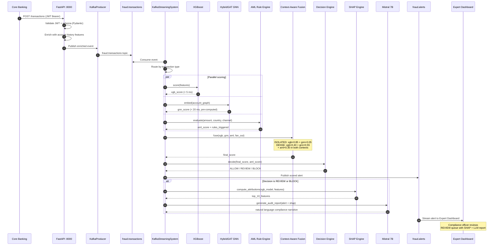
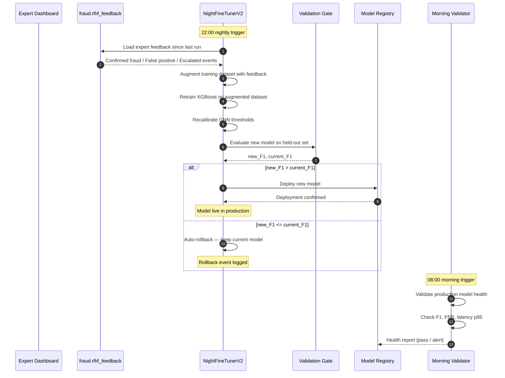
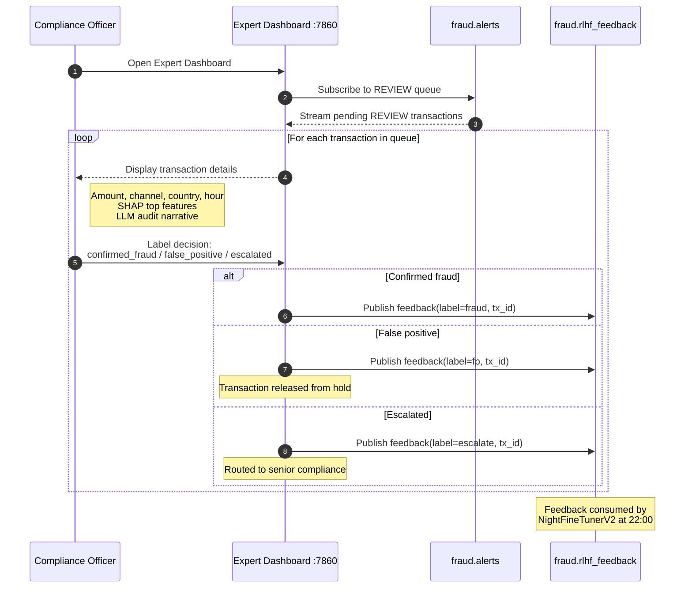

# Sequence Diagrams — AML Fraud Detection Platform

## Transaction Scoring Flow

```mermaid
sequenceDiagram
    autonumber
    participant CB as Core Banking
    participant API as FastAPI :8000
    participant KP as KafkaProducer
    participant KT as fraud.transactions
    participant KSS as KafkaStreamingSystem
    participant XGB as XGBoost
    participant GNN as HybridGAT GNN
    participant AML as AML Rule Engine
    participant FUS as Context-Aware Fusion
    participant DE as Decision Engine
    participant SHAP as SHAP Engine
    participant LLM as Mistral 7B
    participant KA as fraud.alerts
    participant ED as Expert Dashboard

    CB->>API: POST /transactions (JWT Bearer)
    API->>API: Validate JWT + schema (Pydantic)
    API->>API: Enrich with account history features
    API->>KP: Publish enriched event
    KP->>KT: fraud.transactions topic
    KSS->>KT: Consume event
    KSS->>KSS: Route by transaction type

    par Parallel scoring
        KSS->>XGB: score(features)
        XGB-->>KSS: xgb_score (< 5 ms)
    and
        KSS->>GNN: embed(account_graph)
        GNN-->>KSS: gnn_score (< 20 ms, pre-computed)
    and
        KSS->>AML: evaluate(amount, country, channel)
        AML-->>KSS: aml_score + rules_triggered
    end

    KSS->>FUS: fuse(xgb, gnn, aml, fan_out)
    Note over FUS: ISOLATED: xgb×0.85 + gnn×0.05<br/>DENSE: xgb×0.40 + gnn×0.55<br/>+ aml×0.30 in both contexts
    FUS-->>KSS: final_score

    KSS->>DE: decide(final_score, aml_score)
    DE-->>KSS: ALLOW / REVIEW / BLOCK

    KSS->>KA: Publish scored alert

    alt Decision is REVIEW or BLOCK
        KSS->>SHAP: compute_attributions(xgb_model, features)
        SHAP-->>KSS: top_10_features
        KSS->>LLM: generate_audit_report(alert + shap)
        LLM-->>KSS: natural language compliance narrative
    end

    KA->>ED: Stream alert to Expert Dashboard
    Note over ED: Compliance officer reviews<br/>REVIEW queue with SHAP + LLM report
```

---

## RLHF Recalibration Flow (Nightly)

```mermaid
sequenceDiagram
    autonumber
    participant ED as Expert Dashboard
    participant KF as fraud.rlhf_feedback
    participant NFT as NightFineTunerV2
    participant VAL as Validation Gate
    participant MRG as Model Registry
    participant MV as Morning Validator

    Note over NFT: 22:00 nightly trigger

    NFT->>KF: Load expert feedback since last run
    KF-->>NFT: Confirmed fraud / False positive / Escalated events

    NFT->>NFT: Augment training dataset with feedback
    NFT->>NFT: Retrain XGBoost on augmented dataset
    NFT->>NFT: Recalibrate GNN thresholds

    NFT->>VAL: Evaluate new model on held-out set
    VAL-->>NFT: new_F1, current_F1

    alt new_F1 > current_F1
        NFT->>MRG: Deploy new model
        MRG-->>NFT: Deployment confirmed
        Note over NFT: Model live in production
    else new_F1 <= current_F1
        NFT->>NFT: Auto-rollback — keep current model
        Note over NFT: Rollback event logged
    end

    Note over MV: 08:00 morning trigger
    MV->>MV: Validate production model health
    MV->>MV: Check F1, FPR, latency p95
    MV-->>MRG: Health report (pass / alert)
```

---

## Expert Review Flow

```mermaid
sequenceDiagram
    autonumber
    participant CO as Compliance Officer
    participant ED as Expert Dashboard :7860
    participant KA as fraud.alerts
    participant KF as fraud.rlhf_feedback

    CO->>ED: Open Expert Dashboard
    ED->>KA: Subscribe to REVIEW queue
    KA-->>ED: Stream pending REVIEW transactions

    loop For each transaction in queue
        ED-->>CO: Display transaction details
        Note right of CO: Amount, channel, country, hour<br/>SHAP top features<br/>LLM audit narrative
        CO->>ED: Label decision:<br/>confirmed_fraud / false_positive / escalated

        alt Confirmed fraud
            ED->>KF: Publish feedback(label=fraud, tx_id)
        else False positive
            ED->>KF: Publish feedback(label=fp, tx_id)
            Note over ED: Transaction released from hold
        else Escalated
            ED->>KF: Publish feedback(label=escalate, tx_id)
            Note over ED: Routed to senior compliance
        end
    end

    Note over KF: Feedback consumed by<br/>NightFineTunerV2 at 22:00
```
